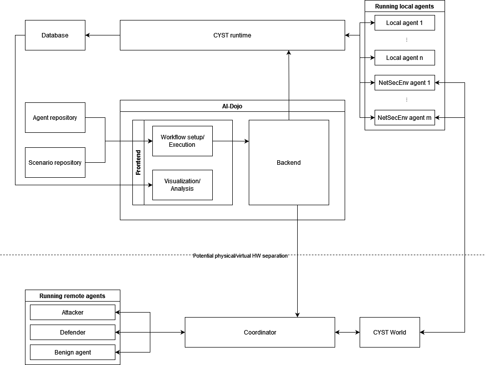

# Architecture

AI-Dojo tries to avoid monolithic architecture as much as possible. It consists of several components that are connected
through public interfaces and thus the whole system can be easily extended and parts can be modified or replaced.

The components of the running system can be divided into several categories:

- machinery for running simulations and emulations,
- applications for controlling the system,
- agents participating in trainings,
- training content, such as scenarios.

Their interplay is roughly depicted in the following image:

## Machinery for running simulations and emulations

AI-Dojo, in the current state, supports running trainings and experiments in either a fully simulated or emulated 
environment. This is accomplished through a cooperation of several components:

- [CYST core](components.md#cyst-core), which provides a unified API for controlling the configuration and execution of 
  training runs and provides a platform for running simulations.
- [dr-emu](components.md#dr-emu), [CIF](components.md#cif), [Cryton](components.md#cryton), [Firehole](components.md#firehole) 
  which enable Docker-based emulation of network topologies.
- [Behavioral model](components.md#cyst-platform-docker-cryton), which provide semantics to agents' actions.

These components generally represent the inside of the area enclosed by the dashed line in the image. In addition to 
these components, there is a database that collects the data from the execution of training runs.

## Applications for controlling the system

AI-Dojo is orchestrated and controlled through an application that provides a frontend to users and also takes care of 
the background tasks of agent/scenario management and launching the simulation/emulation machinery. The application 
resides in two repositories: [AI-Dojo](components.md#ai-dojo) and [Frontend](components.md#frontend).

## Agents participating in trainings

Agents represent the key part of (and the reason for) AI-Dojo. In the current distribution, AI-Dojo supplies users with
a set of offensive and defensive agents. These agents are not closely bundled with the environment (as would be 
suggested by the developer's documentation), but represent a more complex setup, where there exists a central agent
management component [NetSecEnv](components.md#netsecenv), which takes care of agent instantiation, state and action
translation, reward computation, etc. This component communicates with agents' proxy 
[NetSecEnv agent](components.md#cyst-agents-netsecenv), which executes actions within the environments and provides 
the manager with input data.

The setup is illustrated in the following image, where Coordinator is the managements part of NetSecEnv.

The particular agents (Running remote agents in the image) are selected through the configuration in the frontend.

## Training content

The scenarios and topologies where agents train are available through the Frontend. They can be uploaded to the Ai-Dojo
app where they from then on available to users. 

AI-Dojo provides a system for limited creation of procedurally generated scenarios and topologies that can be converted
to AI-Dojo configurations. This is accomplished through two applications:

- [PAGAN](components.md#pagan) for generation of terrains and scenarios and for preparation of configuration files,
- [Gringotts](components.md#gringotts) for providing a Knowledgbase to PAGAN.