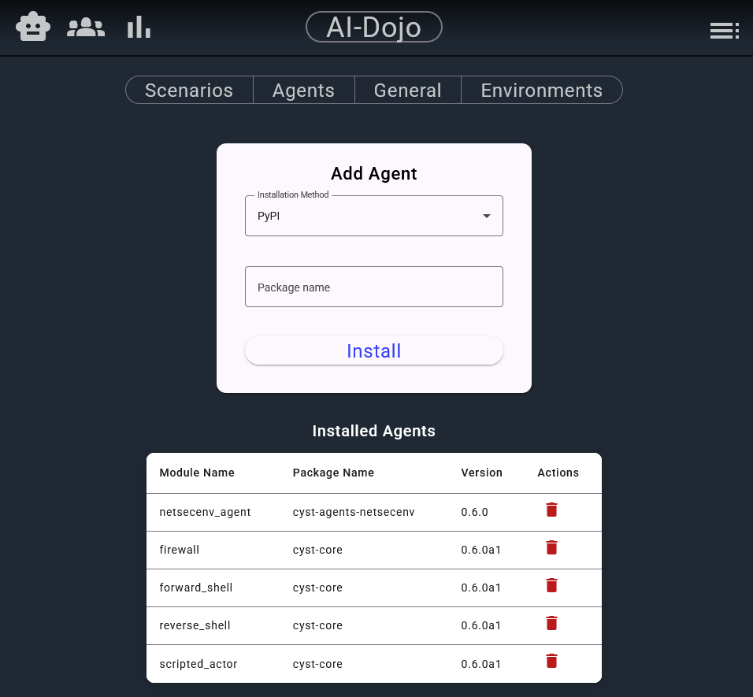
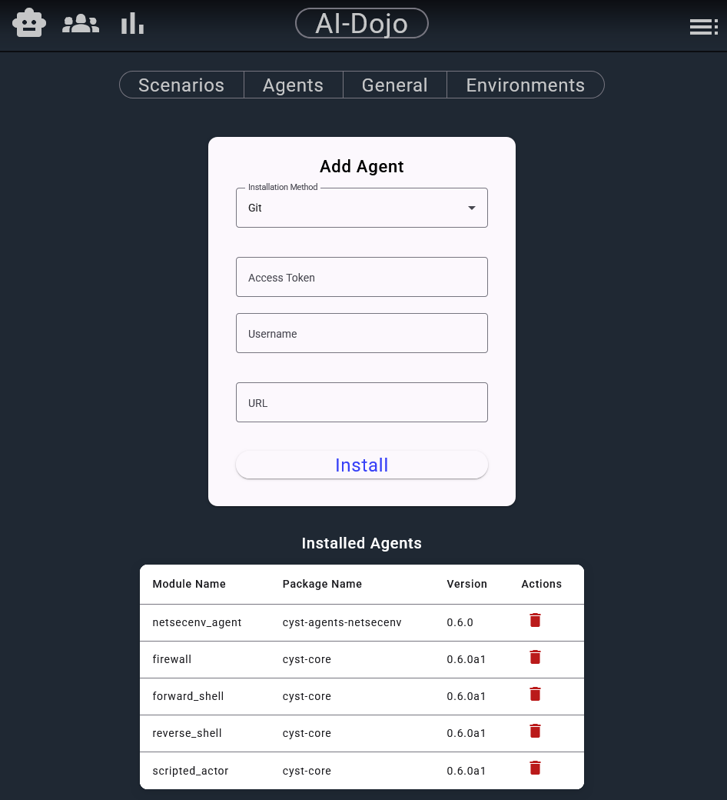

To add and remove agents within the system, visit http://localhost:4200/configuration/agents or go to
**Menu > Configurations > Agents**.

All agents that are available for the AI-Dojo platform must conform to [CYST Active Service specification](https://cyst-core-9f2201.gitlab.io/developer/actions.html#active-services-actors).
These agents can then be added as a plugin to AI-Dojo either through the frontend or via the volume mapping as described
in the [Quickstart](quickstart.md#2-agent-and-plug-in-developers).

If you select agent configuration in the frontend you will be presented with this screen:

At the bottom, you have a list of agents (active services) that are currently installed in the system. For each agent
there is an information about its name, the origin package and the version. If a package provides more than one agent,
they are always all installed. 

The red bin icon enables you to remove an agent, but beware that it actually removes the package, so multiple agents
can be removed this way.

At the top, you have a form that enables you to select an agent to install. The frontend supports two kinds of 
installation - via PyPI or Git. The PyPi is the default option and for installation, you just need to provide the
package name, and it will be installed.

For Git, the form looks like this:

If the agent's repository is publicly accessible, you just need to provide the URL and then click on the "Install" 
button. If the repository is private, you need to also provide an access token and a username for the repository. The
actual download process is handled by the underlying `pip` executable.