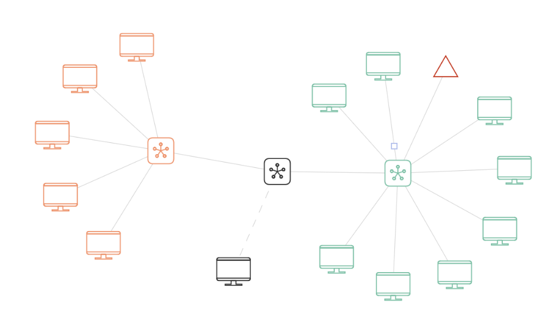

AI-Dojo and its underlying technologies provide a number of ways to analyze the behavior and performance of agents. 

At the most rudimentary level, when a file logging is enabled, the system produces the information in the form of CSV
entries that track sent messages, run statistics, configuration, and custom information. These CSV files have to be 
extracted from the AI-Dojo container and the analysis is completely up to users.

Provided the users have an Elasticsearch stack running and the elasticsearch options is selected when creating an 
environment, runtime data is stored in the database and can be analyzed through provided analytics.

First, there is an option to analyze particular runs with a Vega-powered Kibana extension that is in detail documented 
here: [https://is.muni.cz/auth/th/jl0cs/](https://is.muni.cz/auth/th/jl0cs/). This visualization gives an overview of a
network topology, enables to inspect traversing messages, and do a time-seek and replay of runs. 

Here are some examples of how the visualization looks like:

Image1: Visualization of network topology

Image2: Inspection of traversing messages

Image3: The general UI with time controls

Second, for runs that are executed on the emulation platform, which does not enable such a deep insight into the 
internal details, users can utilize the visualization provided by the Cryton framework, which is included in the
frontend.

Image4: Cryton UI

Image5: Visualization of action sequence

And finally, when using agents through the NetSecGame coordinator (i.e., not fully custom agents), many a data is 
collected and can provide an important insights into agents' working.

Image6: Histogram of action utilization

Image7: Trajectory step comparison

Image8: Action sequences

Despite our efforts, these analytic tools are still in the prototype mode, so they may be sometime hard to use or to
even launch correctly. Depending on the time you are reading this, you may need to contact us if you want to utilize 
these visualizations.
