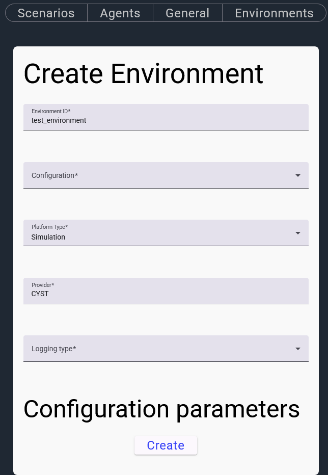
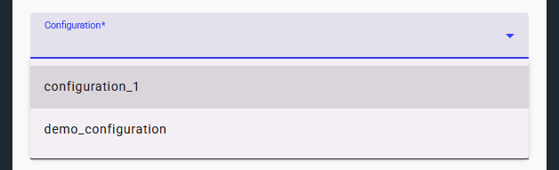
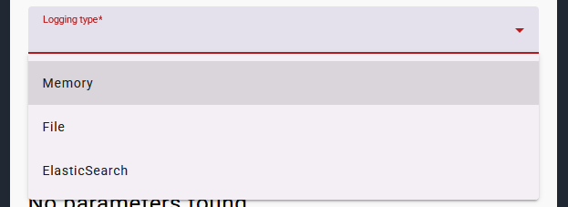
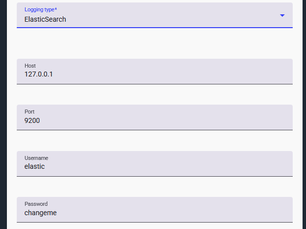
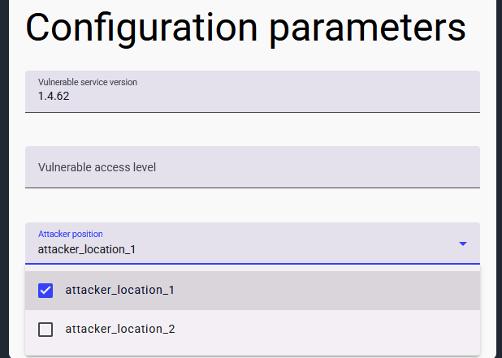
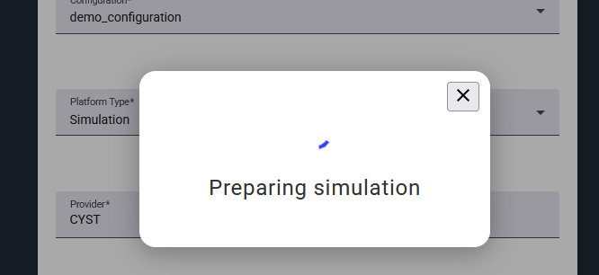
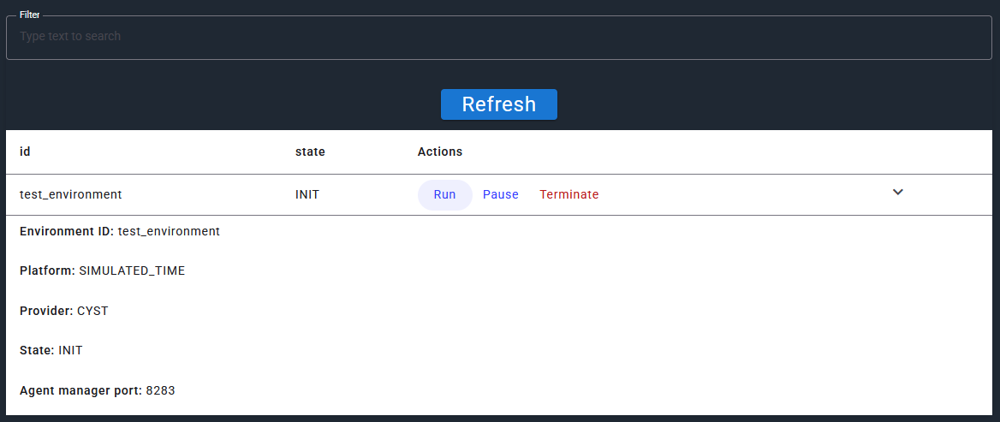

If you have your scenarios defined and agents prepared, it is now time to configure particular runs.

In the **Configuration > General** section, you will find a form for run preparation.

This form enables you to specify the necessary parameters:

- unique ID of a run
- scenario configuration
- execution environment
- logging options
- scenario parametrization

The scenario configuration can be chosen from the scenarios in the **Scenarios** section.

The execution environment is defined by two parameters: 

- Platform type: which governs whether the environment has a full control of time (simulation), or if the time passes 
  normally (emulation).
- Provider: which specifies, which platform to use. Currently, there are only two options: "CYST" or "docker+cryton".

Logging options determine, how the data from runs is stored.

For the ElasticSearch option, there are additional parameters that are dependent on your ElasticSearch instance:

Some scenarios can be further parametrized by a user and this parametrization can have important implications for
the runs. For example, in case of configuration_1, there is an option to select a version of a target service, which
influences whether an attacker is able to correctly finish the scenario. Or there is an option to specify a starting
location of the attacker.

Once you are content with the specified parameters, you can click on the **Create** button and the scenario gets 
prepared.

Beware that in case of Docker-based emulation, the creation process includes building of vulnerable images on the
first run and as such, it may take a rather long time. It gets better on subsequent runs, though.

Once the scenario is prepared, you can move to another tab, where you execute the run, and then you can move on to
analysing the results...

