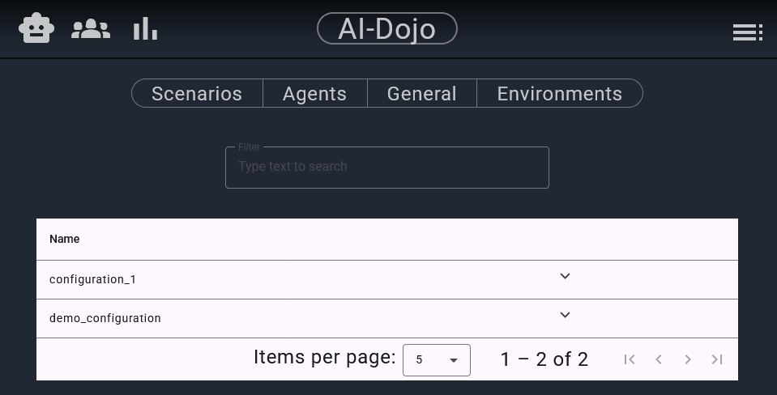
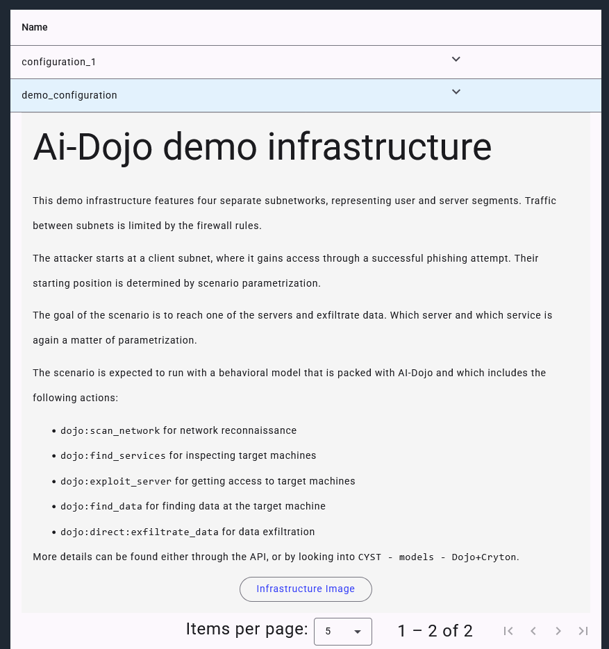
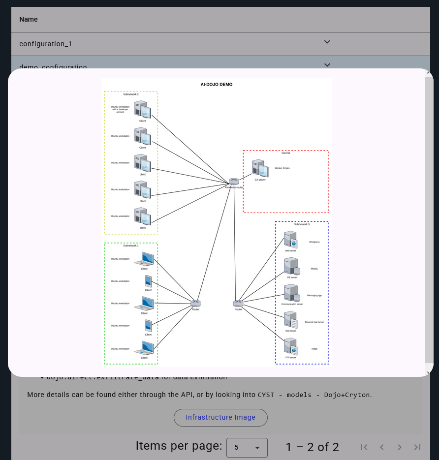

Scenarios are a key concept in AI-Dojo workflow. A scenario defines a network terrain, where interactions happen, as 
well as all the internal logic, which enables sensible execution and evaluation of agents' actions.

To specify a scenario, a description conforming to the [CYST configuration](https://cyst-core-9f2201.gitlab.io/api/index.html#module-cyst.api.configuration.configuration)
is used. In addition, a scenario description and visualization can be provided.

In the frontend, scenarios are available at http://localhost:4200/configuration/scenarios, or through **Menu > Configurations > Scenarios**.
If you go there, you should see something like this:

By default, AI-Dojo contains only a handful of ready-made scenarios, but we aim to gradually add new scenarios with
varying difficulty.

If you click on the arrow next to the name of a scenario, its description is revealed:

Then, if a visualization of the scenario is provided, you can click on the `Infrastructure image` button to reveal it:

Uploading scenarios is currently only possible by direct deployment to the docker container, but that will soon be 
changed. In the meantime, this part of the frontend serves mainly for exploring the available scenarios.